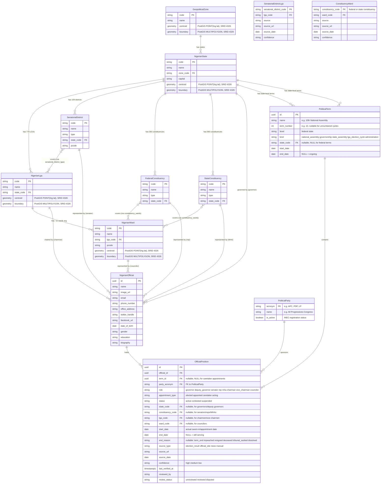
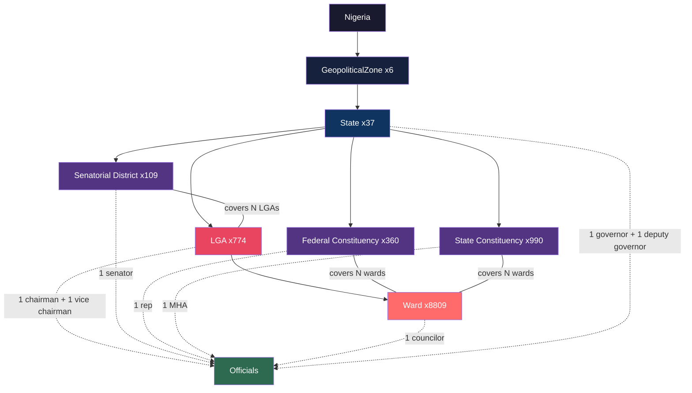

# Admin Hierarchy Data Relationships

## Entity-Relationship Diagram

## Hierarchy Flow Diagram

## Notes

1. **Single table, three types.** SenatorialDistrict, FederalConstituency, and StateConstituency are all rows in `nigerian_constituencies` distinguished by the `type` column. Separated visually because they have different cardinalities and relationships.

2. **Two separate mapping tables, not one polymorphic table.** Senatorial Districts map to LGAs via `senatorial_district_lgas` — this is a clean 1:1 mapping (3 districts per state, each covering whole LGAs, no splits). Federal and State Constituencies map to wards via `constituency_wards` — this is the only correct resolution because both types split LGAs in densely populated areas (e.g., Lagos: 24 federal constituencies ÷ 20 LGAs; Surulere LGA → "Surulere I" and "Surulere II"). There is no "fallback" LGA mapping for Federal or State Constituencies — storing known-inaccurate data invites developer error.

3. **"Find My Representatives" query strategy — ward is the ideal entry point, but support must be coverage-gated:**
   - **Governor + Deputy Governor:** Derive state from ward's LGA's state.
   - **Senator:** Ward → LGA → `senatorial_district_lgas` → senatorial district → official.
   - **Federal Rep:** Ward → `constituency_wards` → federal constituency → official.
   - **State MHA:** Ward → `constituency_wards` → state constituency → official.
   - **LGA Chairman + Vice Chairman:** Ward → LGA → direct lookup (includes `appointment_type` to flag caretaker).
   - **Councilor:** Direct ward lookup.
   - The ward is the atomic unit when ward coverage and ward boundaries exist. If the user provides only an LGA, the UI prompts for ward selection only when that LGA is marked `supported` or `partial` in a generated coverage/support matrix. GPS coordinates resolve to ward via PostGIS `ST_Contains()` only where ward boundaries exist; otherwise GPS resolves to LGA and returns a partial-coverage result.

4. **Senatorial is the only constituency type that maps to LGAs.** Every LGA belongs to exactly one senatorial district (data from GeoJSON pcodes, 100% coverage) via `senatorial_district_lgas`. Federal and State Constituencies map to wards only — no LGA mapping exists or should exist for these types.

5. **Officials use exclusive arcs, not polymorphic FKs.** `OfficialPosition` has four nullable FK columns (`state_code`, `constituency_code`, `lga_code`, `ward_code`) with a CHECK constraint ensuring exactly one is NOT NULL. This gives database-level referential integrity — if an LGA is renamed/merged or a constituency deleted, the FK constraint catches it instead of silently orphaning rows. The `role` column remains for quick filtering, but the model also needs a role-scope CHECK so invalid combinations are impossible: governors/deputies can only point to `state_code`, senators/reps/MHAs only to `constituency_code`, chairmen/vice chairmen only to `lga_code`, and councilors only to `ward_code`.

6. **Ward sits below LGA, not below constituency.** Wards belong to LGAs, and councilors are tied to wards. State Constituencies map to wards via `constituency_wards`, but this is a parallel mapping — wards are not children of constituencies in the hierarchy.

7. **PostGIS for spatial data, not raw JSON.** Boundaries are stored as PostGIS `geometry(MultiPolygon, 4326)` columns, not JSON blobs. Centroids are `geometry(Point, 4326)`. This enables spatial queries like `ST_Contains(boundary, ST_SetSRID(ST_MakePoint(lng, lat), 4326))` to resolve a GPS coordinate to its containing ward/LGA/state in milliseconds. GIST indexes on boundary columns make these queries fast. SRID 4326 = WGS84 (standard GPS coordinates). Use `ST_AsGeoJSON()` to export back to GeoJSON when needed (e.g., for frontend map rendering).

8. **Party lives on the position, not the official.** Nigerian politicians frequently defect ("cross-carpet") between parties across election cycles. Storing `party` on `NigerianOfficial` would rewrite history on every update. Instead, `party_acronym` is a FK to `PoliticalParty` on `OfficialPosition` — scoped to a specific term. The official's current party is derived from the preferred active position, not raw string overwrite. This preserves the full history (e.g., a governor who served under PDP 2015-2019 then defected to APC for a Senate run in 2023). Because source data is messy, migration to `party_acronym` should go through an explicit alias-mapping table plus a reject queue for unmapped values; uppercase-and-trim is not sufficient normalization.

9. **No `is_current` boolean — derive from dates.** `is_current` is a denormalization that requires a cron job or trigger to stay in sync with `end_date`, and bugs can leave two people marked as current for the same seat. Instead, "current" is computed: `WHERE start_date <= CURRENT_DATE AND (end_date IS NULL OR end_date > CURRENT_DATE)`. A SQL view `current_positions` wraps this for convenience. `end_date IS NULL` means "still serving."

10. **No hard exclusion constraints — use `status` plus ranked current views for political reality.** Nigerian politics produces situations where hard non-overlap constraints would cause application failures: tribunal disputes where two people claim the same seat, acting governors serving while the substantive governor is suspended, caretaker transitions. Instead of database-level exclusion constraints, `OfficialPosition` has a `status` column:
    - `active` — currently exercising the powers of the office.
    - `contested` — claims the seat but legitimacy is disputed (e.g., tribunal in progress).
    - `suspended` — temporarily not exercising powers (e.g., medical leave, court order).
    - Application-level validation should not stop at warnings. Keep all active claims in `current_positions`, but derive a `preferred_current_positions` view that ranks rows by `review_status`, `confidence`, `source_date`, and recency so the default UX can show one preferred record while still exposing rival claims and provenance.

11. **`appointment_type` distinguishes elected from appointed officials.** Critical for a corruption-tracking platform:
    - `elected` — won an election (standard path for governors, legislators, chairmen).
    - `appointed` — appointed by a higher authority (e.g., minister, FCT administrator).
    - `caretaker` — appointed by the state governor after dissolving an elected LGA council. Governors routinely (and often unconstitutionally) dissolve elected councils and install loyalists as "Caretaker Committee Chairmen." These officials control LGA budgets without democratic mandate — this distinction is essential data.
    - `acting` — temporarily exercising powers of a higher office (e.g., deputy governor serving as acting governor during incapacitation, vice chairman serving as acting chairman).

12. **Executive joint tickets: governors + deputies, chairmen + vice chairmen.** Nigerian executives run on joint tickets. The `role` column includes `deputy_governor` and `vice_chairman` alongside `governor` and `chairman`. Both officials reference the same jurisdiction (`state_code` for governors, `lga_code` for chairmen). Succession is modeled naturally: when a governor dies/is impeached, their position gets `end_date` set + `end_reason = 'deceased'/'impeached'`, and the deputy governor's existing position gets `end_date` set, followed by a new position row with `role = 'governor'` and `appointment_type = 'acting'` (or `elected` if they complete the term). The `end_reason` column tracks why a position ended: `term_end`, `impeached`, `resigned`, `deceased`, `tribunal_sacked`, `dissolved` (for caretaker transitions).

13. **`PoliticalTerm` groups cohorts by assembly/cycle, but `level` alone is too weak. `term_id` is nullable.** Nigerian politics is tracked by Assembly number (e.g., "10th National Assembly" = 2023-2027), but the same state can also have governorship terms, state assembly terms, FCT administration terms, and LGA election cycles. `PoliticalTerm` therefore needs both `level` and `kind`:
    - `level = 'federal', kind = 'national_assembly'`: National Assembly terms (e.g., 10th Assembly). `state_code` is NULL. Applies to senators and federal reps.
    - `level = 'state', kind = 'governorship'`: Governorship cycles for governors and deputy governors.
    - `level = 'state', kind = 'state_assembly'`: State Assembly cycles for MHAs.
    - `level = 'state', kind = 'lga_election_cycle'`: State-managed LGA election cycles for elected chairmen and councilors.
    - `level = 'state', kind = 'administration'`: FCT or similar non-standard administrative cycles where needed.
    - `term_number` enables simple queries like "all 10th Assembly senators" where numbering exists, but it should be nullable for unnumbered cycles such as governorship/admin terms. Uniqueness should be modeled on `(level, kind, state_code, term_number)` rather than overloading `level` + `term_number`.
    - `start_date`/`end_date` on the term define the nominal cycle; `start_date`/`end_date` on `OfficialPosition` track the individual's actual service.
    - **`term_id` is nullable.** Caretaker/appointed officials do NOT belong to a `PoliticalTerm`. A "term" represents a democratic election cycle — caretaker appointments are the absence of one. A caretaker chairman appointed by the governor for 3 months (or extended indefinitely) is tracked purely by `start_date`/`end_date` + `appointment_type = 'caretaker'` with `term_id = NULL`. This avoids a combinatorial explosion of synthetic "terms" for every ad-hoc gubernatorial appointment across 774 LGAs.
    - There is no `lga_code` on `PoliticalTerm`. LGA election cycles are state-managed — when a state holds LGA elections, it creates a state-level term that all elected chairmen/councilors in that state reference. The fragmentation is handled by the fact that different states hold LGA elections at different times, and caretaker periods between elections simply have `term_id = NULL`.

14. **`PoliticalParty` table — no free-text party strings.** In Nigeria, you cannot run as an independent candidate; every candidate must be sponsored by an INEC-registered political party. Storing `party` as a free-text string on `OfficialPosition` invites normalization nightmares — "APC", "A.P.C", "All Progressives Congress" would all be different values, and queries like "How much did APC governors spend?" would silently miss rows. Instead, `OfficialPosition.party_acronym` is a foreign key to `PoliticalParty(acronym, name, is_active)`. The `acronym` (e.g., "APC", "PDP", "LP") is the primary key since it's the canonical short identifier used everywhere in Nigerian politics. `is_active` tracks INEC registration status — parties can be deregistered (INEC deregistered 74 parties in 2020), and historical positions should still reference them. Party mergers and name changes (e.g., ACN + CPC + ANPP → APC in 2013) are handled by creating the new party and leaving historical positions pointing to the old one — this preserves the accurate record of which party sponsored an official at the time they held office.

15. **Provenance is part of the model, not an implementation detail.** Mapping tables and `OfficialPosition` need `source`, `source_url`, `source_date`, `confidence`, and review metadata. This data will be politically contested. Without provenance, the platform cannot explain why a ward/constituency mapping or official assignment should be trusted, cannot rank conflicting claims, and cannot support operator review.

16. **Coverage support must be explicit.** A strict ward-first model is only honest if the product exposes where it is actually supported. Generate a state/LGA support matrix from real ward and mapping coverage and make API/UI behavior conditional on it:
    - `supported`: sufficient ward records plus constituency mappings to resolve ward-dependent representatives.
    - `partial`: some ward/mapping data exists, but UX must prompt and explain limitations.
    - `unsupported`: no ward-dependent representative lookup should be implied.
