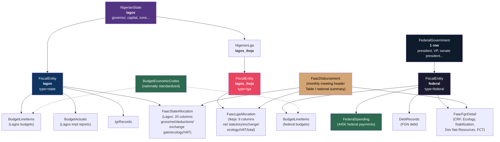

# Fiscal Data Models - Entity Relationship Diagram

> Generated from `.agent/plans/37.fiscal-data-models.md`
> NigerianState matches the model in `design/admin-hierarchy-relationships.md`
> **v2** — incorporates all valid criticisms from ruthless review

```mermaid
erDiagram
    %% ============================================
    %% EXISTING TABLES
    %% ============================================

    FederalGovernment {
        varchar code PK "always 'federal'"
        varchar name "Federal Republic of Nigeria"
        varchar capital "Abuja"
        varchar president_name "nullable, current president"
        varchar vice_president_name "nullable"
        varchar senate_president_name "nullable"
        varchar speaker_name "nullable, Speaker of House of Reps"
        varchar sgf_name "nullable, Secretary to the Govt"
        varchar chief_justice_name "nullable, CJN"
        timestamptz created_at
        timestamptz updated_at
    }

    NigerianState {
        varchar code PK "e.g. 'lagos', 'adamawa', 'fct'"
        varchar name "e.g. 'Lagos', 'Adamawa'"
        varchar zone_code FK "→ GeopoliticalZone"
        varchar capital
        geometry centroid "PostGIS POINT"
        geometry boundary "PostGIS MULTIPOLYGON"
    }

    NigerianLga {
        varchar code PK "e.g. 'lagos_ikeja'"
        varchar name
        varchar state_code FK "→ NigerianState"
    }

    Document {
        uuid id PK
        varchar entity_code FK "→ FiscalEntity (canonical linkage)"
        varchar state_code FK "→ NigerianState (denorm helper, nullable)"
        smallint fiscal_year
        varchar file_name
        varchar file_path UK
        varchar status
    }

    %% ============================================
    %% Fiscal Entity (federal + state + LGA)
    %% ============================================

    FiscalEntity {
        varchar code PK "e.g. 'federal', 'lagos', 'lagos_ikeja'"
        varchar name "e.g. 'Federal Government', 'Lagos State', 'Ikeja LGA'"
        varchar entity_type "federal | state | lga"
        varchar federal_code FK "→ FederalGovernment, NULL unless federal"
        varchar state_code FK "→ NigerianState, NULL if federal or lga-only"
        varchar lga_code FK "→ NigerianLga, NULL unless LGA"
    }

    %% ============================================
    %% NCoA DIMENSION TABLES
    %% ============================================

    BudgetAdminCode {
        uuid id PK
        varchar code "12 digits e.g. 011100100100"
        varchar entity_code FK "→ FiscalEntity"
        text name "e.g. Governor's Office"
        smallint level "1=sector 2=sub 3=MDA 4=dept"
        uuid parent_id FK "→ BudgetAdminCode.id, nullable"
        timestamptz created_at
        timestamptz updated_at
    }

    BudgetEconomicCode {
        varchar code PK "8 digits e.g. 21010101"
        text name "e.g. Basic Salary"
        smallint level "1=cat 2=sub 3=item 4=detail"
        varchar parent_code FK "→ BudgetEconomicCode.code"
        varchar type "revenue | expenditure"
        timestamptz created_at
        timestamptz updated_at
    }

    BudgetFunctionCode {
        varchar code PK "5 digits COFOG e.g. 70111"
        text name "e.g. Executive Organ"
        smallint level "1=div 2=group 3=class"
        varchar parent_code FK "→ BudgetFunctionCode.code"
        timestamptz created_at
        timestamptz updated_at
    }

    BudgetFundCode {
        varchar code PK "5 digits e.g. 02101"
        text name "e.g. Main Envelope"
        timestamptz created_at
        timestamptz updated_at
    }

    BudgetProgramme {
        uuid id PK
        varchar code "14 digits"
        text name "e.g. Economic Growth"
        varchar entity_code FK "→ FiscalEntity"
        timestamptz created_at
        timestamptz updated_at
    }

    BudgetLocation {
        uuid id PK
        varchar code "8 digits e.g. 20232000"
        text name "e.g. YOLA NORTH"
        varchar entity_code FK "→ FiscalEntity"
        timestamptz created_at
        timestamptz updated_at
    }

    %% ============================================
    %% BUDGET FACT TABLES
    %% ============================================

    BudgetLineItem {
        uuid id PK
        varchar entity_code FK "→ FiscalEntity"
        smallint fiscal_year
        uuid admin_id FK "→ BudgetAdminCode.id"
        varchar economic_code FK "→ BudgetEconomicCode"
        varchar function_code FK "→ BudgetFunctionCode nullable"
        varchar fund_code FK "→ BudgetFundCode nullable"
        uuid location_id FK "→ BudgetLocation.id nullable"
        uuid programme_id FK "→ BudgetProgramme.id nullable"
        varchar budget_type "recurrent_revenue etc"
        text description "nullable"
        decimal_20_2 prev_year_budget "nullable Naira"
        decimal_20_2 prev_year_actual "nullable Naira"
        decimal_20_2 approved_budget "Naira"
        decimal_20_2 out_year_1 "nullable Naira"
        decimal_20_2 out_year_2 "nullable Naira"
        uuid source_document_id FK "→ Document nullable"
        timestamptz created_at
        timestamptz updated_at
    }

    BudgetActual {
        uuid id PK
        varchar entity_code FK "→ FiscalEntity"
        smallint fiscal_year
        smallint quarter "1 2 3 4"
        varchar report_section "revenue | expenditure | capital"
        uuid admin_id FK "→ BudgetAdminCode.id nullable"
        varchar economic_code FK "→ BudgetEconomicCode nullable"
        varchar function_code FK "→ BudgetFunctionCode nullable"
        uuid programme_id FK "→ BudgetProgramme.id nullable"
        text description "nullable"
        decimal_20_2 original_budget "Naira"
        decimal_20_2 quarterly_actual "Naira"
        decimal_20_2 ytd_actual "Naira"
        decimal_5_2 performance_pct "pct YTD vs budget"
        decimal_20_2 balance "budget minus ytd_actual"
        uuid source_document_id FK "→ Document nullable"
        timestamptz created_at
        timestamptz updated_at
    }

    BudgetMetadata {
        uuid id PK
        varchar entity_code FK "→ FiscalEntity"
        smallint fiscal_year
        varchar head_of_government "nullable governor or president"
        varchar head_party "nullable"
        text head_image_url "nullable"
        text head_profile_url "nullable"
        varchar finance_head_name "nullable commissioner or minister"
        varchar finance_head_title "nullable"
        varchar legislature_head "nullable speaker or senate president"
        varchar appropriation_chair "nullable"
        varchar accountant_general "nullable"
        timestamptz created_at
        timestamptz updated_at
    }

    %% ============================================
    %% DOMAIN-SPECIFIC TABLES
    %% ============================================

    FederalSpending {
        uuid id PK
        varchar entity_code FK "→ FiscalEntity (federal only)"
        date date
        varchar payment_no UK
        varchar payer_code "maps to federal admin codes"
        text organization_name
        text beneficiary_name
        decimal_20_2 amount "Naira"
        text description
        text source_url "nullable"
        timestamptz scraped_at
        timestamptz created_at
    }

    IgrRecord {
        uuid id PK
        varchar entity_code FK "→ FiscalEntity (states only)"
        smallint fiscal_year
        varchar period "annual | H1 | Q1 etc"
        decimal_20_2 paye "nullable"
        decimal_20_2 direct_assessment "nullable"
        decimal_20_2 road_taxes "nullable"
        decimal_20_2 stamp_duties "nullable"
        decimal_20_2 capital_gain_tax "nullable"
        decimal_20_2 withholding_tax "nullable"
        decimal_20_2 other_taxes "nullable"
        decimal_20_2 lga_revenue "nullable"
        decimal_20_2 total_tax "nullable"
        decimal_20_2 mdas_revenue "nullable"
        decimal_20_2 total
        text source_notes "nullable, for drift/anomalies"
        timestamptz created_at
    }

    DebtRecord {
        uuid id PK
        varchar entity_code FK "→ FiscalEntity"
        date quarter "first day of quarter"
        varchar debt_type "domestic | external"
        varchar creditor_category "nullable e.g. multilateral"
        decimal_20_2 amount
        varchar currency "NGN | USD"
        varchar instrument "nullable e.g. bond, loan, promissory_note"
        date maturity_date "nullable"
        jsonb source_snapshot "nullable, raw source row for future ext"
        timestamptz created_at
    }

    FaacDisbursement {
        uuid id PK
        smallint revenue_year "revenue month year, 0 if unknown"
        smallint revenue_month "revenue month, 0 if unknown"
        smallint disbursement_year "year FAAC meeting disbursed"
        smallint disbursement_month "month FAAC meeting disbursed"
        decimal_20_2 total_statutory "Table I footer: total statutory pool"
        decimal_20_2 total_exchange_gain "Table I footer: total exchange gain"
        decimal_20_2 total_emtl "Table I footer: total EMTL"
        decimal_20_2 total_vat "Table I footer: total VAT"
        decimal_20_2 grand_total "Table I footer: overall grand total"
        decimal_20_2 fgn_total "Table I: FGN allocation total"
        decimal_20_2 states_total "Table I: all states total"
        decimal_20_2 lgcs_total "Table I: all LGCs total"
        decimal_20_2 derivation_13pct_total "Table I: 13pct derivation fund"
        decimal_20_2 cost_of_collection_ncs "Table I: NCS collection cost"
        decimal_20_2 cost_of_collection_firs "Table I: FIRS collection cost"
        decimal_20_2 cost_of_collection_nuprc "Table I: NUPRC collection cost"
        decimal_20_2 transfer_to_nmdpra "Table I: NMDPRA transfer"
        jsonb special_items "Table I variable items: refunds, NEDC, excess account transfers etc"
        text source_description "PDF filename or OAGF meeting ref"
        uuid source_document_id FK "→ Document nullable"
        timestamptz created_at
    }

    FaacFgnDetail {
        uuid id PK
        uuid disbursement_id FK "→ FaacDisbursement"
        varchar beneficiary "CRF Account, Derivation and Ecology, Stabilization, Dev Natural Resources, FCT-Abuja"
        smallint sort_order "display order from Table II"
        decimal_20_2 gross_statutory
        decimal_20_2 total_deduction "nullable, negative in source"
        decimal_20_2 net_statutory
        decimal_20_2 exchange_gain
        decimal_20_2 emtl "nullable"
        decimal_20_2 vat "nullable"
        decimal_20_2 total
        timestamptz created_at
    }

    FaacStateAllocation {
        uuid id PK
        uuid disbursement_id FK "→ FaacDisbursement"
        varchar entity_code FK "→ FiscalEntity (state)"
        smallint num_lgcs "number of LGAs in state"
        decimal_20_2 gross_statutory "col 4: gross statutory allocation"
        decimal_20_2 derivation_13pct "col 5: 13pct derivation net, null if non-oil"
        decimal_20_2 gross_total "col 6: gross_statutory + derivation_13pct"
        decimal_20_2 deduction_external_debt "col 7: external debt deduction"
        decimal_20_2 deduction_ispo "col 8: contractual obligation / ISPO"
        decimal_20_2 deduction_other "col 9: other deductions"
        decimal_20_2 net_statutory "col 10: gross_total minus all deductions"
        decimal_20_2 exchange_gain "col 11: exchange gain allocation"
        decimal_20_2 exchange_gain_derivation_13pct "col 12: 13pct derivation on exchange gain"
        decimal_20_2 total_exchange_gain "col 13: exchange_gain + exchange_gain_derivation"
        decimal_20_2 emtl "col 14: electronic money transfer levy"
        decimal_20_2 ecology_gross "col 15: share of ecology"
        decimal_20_2 ecology_transfer_nddc_hyppadec "col 16: transfer to NDDC/HYPPADEC"
        decimal_20_2 ecology_net "col 17: ecology_gross minus transfer"
        decimal_20_2 vat_gross "col 18: gross VAT allocation"
        decimal_20_2 vat_deduction "col 19: VAT deduction"
        decimal_20_2 vat_net "col 20: vat_gross minus vat_deduction"
        decimal_20_2 total_gross "col 21: sum of all gross components"
        decimal_20_2 total_net "col 22: sum of all net components"
        timestamptz created_at
    }

    FaacLgaAllocation {
        uuid id PK
        uuid disbursement_id FK "→ FaacDisbursement"
        varchar entity_code FK "→ FiscalEntity (lga)"
        decimal_20_2 net_statutory "col 1: net statutory allocation"
        decimal_20_2 deduction "col 2: deduction, usually 0"
        decimal_20_2 exchange_gain "col 3"
        decimal_20_2 emtl "col 4: electronic money transfer levy"
        decimal_20_2 ecology_gross "col 5: share of ecology"
        decimal_20_2 ecology_transfer_nddc_hyppadec "col 6"
        decimal_20_2 ecology_net "col 7: ecology_gross minus transfer"
        decimal_20_2 vat "col 8: value added tax"
        decimal_20_2 total_net "col 9: total net allocation"
        timestamptz created_at
    }

    GdpRecord {
        uuid id PK
        varchar entity_code FK "→ FiscalEntity (states only)"
        smallint year
        varchar sector_code "ISIC Rev 4"
        text sector_name
        decimal_20_2 amount "Naira millions"
        timestamptz created_at
    }

    PopulationEstimate {
        uuid id PK
        varchar entity_code FK "→ FiscalEntity"
        smallint year
        bigint population
        varchar source "NPC or NBS or Census"
        timestamptz created_at
    }

    %% ============================================
    %% RELATIONSHIPS
    %% ============================================

    %% -- FiscalEntity bridges federal, states, and LGAs --
    FederalGovernment ||--o| FiscalEntity : "federal entity"
    NigerianState ||--o| FiscalEntity : "state entity"
    NigerianLga ||--o| FiscalEntity : "LGA entity"
    FiscalEntity ||--o{ BudgetAdminCode : "has MDAs"
    FiscalEntity ||--o{ BudgetProgramme : "has programmes"
    FiscalEntity ||--o{ BudgetLocation : "has locations"

    %% -- Document provenance via FiscalEntity --
    FiscalEntity ||--o{ Document : "owns documents"

    %% -- Self-referential hierarchies --
    BudgetAdminCode ||--o{ BudgetAdminCode : "parent (via parent_id)"
    BudgetEconomicCode ||--o{ BudgetEconomicCode : "parent"
    BudgetFunctionCode ||--o{ BudgetFunctionCode : "parent"

    %% -- Budget Line Items (proper FKs to dimension tables) --
    FiscalEntity ||--o{ BudgetLineItem : "budgets"
    BudgetAdminCode ||--o{ BudgetLineItem : "which MDA (via admin_id)"
    BudgetEconomicCode ||--o{ BudgetLineItem : "what type"
    BudgetFunctionCode ||--o{ BudgetLineItem : "what purpose"
    BudgetFundCode ||--o{ BudgetLineItem : "funding source"
    BudgetLocation ||--o{ BudgetLineItem : "where (via location_id)"
    BudgetProgramme ||--o{ BudgetLineItem : "programme (via programme_id)"
    Document ||--o{ BudgetLineItem : "source doc"

    %% -- Budget Actuals --
    FiscalEntity ||--o{ BudgetActual : "actuals"
    BudgetAdminCode ||--o{ BudgetActual : "which MDA (via admin_id)"
    BudgetEconomicCode ||--o{ BudgetActual : "what type"
    BudgetFunctionCode ||--o{ BudgetActual : "what purpose"
    BudgetProgramme ||--o{ BudgetActual : "programme (via programme_id)"
    Document ||--o{ BudgetActual : "source doc"

    %% -- Budget Metadata --
    FiscalEntity ||--o{ BudgetMetadata : "budget year info"

    %% -- Domain tables --
    FiscalEntity ||--o{ IgrRecord : "IGR"
    FiscalEntity ||--o{ DebtRecord : "debt"
    FiscalEntity ||--o{ GdpRecord : "GDP"
    FiscalEntity ||--o{ PopulationEstimate : "population"
    FiscalEntity ||--o{ FaacStateAllocation : "FAAC state recipient"
    FiscalEntity ||--o{ FaacLgaAllocation : "FAAC LGA recipient"
    FaacDisbursement ||--o{ FaacFgnDetail : "FGN sub-allocations"
    FaacDisbursement ||--o{ FaacStateAllocation : "state allocations"
    FaacDisbursement ||--o{ FaacLgaAllocation : "LGA allocations"

    FiscalEntity ||--o{ FederalSpending : "federal spending"

    %% -- Existing hierarchy --
    NigerianState ||--o{ NigerianLga : "contains"
```



---

## Constraints & Integrity Rules

These constraints are **required in migration SQL**, not optional prose. Listed here so the ERD is operationally unambiguous.

### FiscalEntity Integrity (#3)

```sql
-- Exactly one FK is NOT NULL, matching entity_type
ALTER TABLE fiscal_entities ADD CONSTRAINT chk_fiscal_entity_exclusive_arc
  CHECK (
    (entity_type = 'federal' AND federal_code IS NOT NULL AND state_code IS NULL AND lga_code IS NULL)
    OR (entity_type = 'state' AND federal_code IS NULL AND state_code IS NOT NULL AND lga_code IS NULL)
    OR (entity_type = 'lga'   AND federal_code IS NULL AND state_code IS NULL AND lga_code IS NOT NULL)
  );

-- Uniqueness per level
CREATE UNIQUE INDEX uq_fiscal_entity_federal ON fiscal_entities (federal_code) WHERE federal_code IS NOT NULL;
CREATE UNIQUE INDEX uq_fiscal_entity_state   ON fiscal_entities (state_code)   WHERE state_code IS NOT NULL;
CREATE UNIQUE INDEX uq_fiscal_entity_lga     ON fiscal_entities (lga_code)     WHERE lga_code IS NOT NULL;
```

### BudgetAdminCode Identity (#1)

```sql
-- Surrogate PK (id) for FK references from fact tables.
-- Natural unique key (code, entity_code) for ingestion dedupe and human queries.
-- Facts store admin_id (UUID FK), NOT admin_code string.
CREATE UNIQUE INDEX uq_admin_code_entity ON budget_admin_codes (code, entity_code);

-- Parent references use parent_id (surrogate), not parent_code string.
-- This resolves the ambiguity where the same code exists in multiple entities.
ALTER TABLE budget_admin_codes ADD CONSTRAINT fk_admin_parent
  FOREIGN KEY (parent_id) REFERENCES budget_admin_codes (id);
```

### BudgetProgramme & BudgetLocation Identity (#6)

```sql
-- Same pattern as admin codes: surrogate PK + natural unique key.
-- Facts reference programme_id and location_id (UUIDs), not code strings.
CREATE UNIQUE INDEX uq_programme_code_entity ON budget_programmes (code, entity_code);
CREATE UNIQUE INDEX uq_location_code_entity  ON budget_locations (code, entity_code);
```

### Cross-Entity Consistency

Dimension tables (admin codes, programmes, locations) are scoped to an entity. A fact row must not reference a dimension from a different entity. Prisma cannot express this — enforced via trigger in migration SQL.

```sql
-- Prevent cross-entity dimension references on INSERT/UPDATE
CREATE OR REPLACE FUNCTION check_budget_line_item_entity_consistency()
RETURNS TRIGGER AS $$
BEGIN
  -- admin_id must belong to the same entity
  IF NEW.admin_id IS NOT NULL AND NOT EXISTS (
    SELECT 1 FROM budget_admin_codes WHERE id = NEW.admin_id AND entity_code = NEW.entity_code
  ) THEN
    RAISE EXCEPTION 'admin_id % does not belong to entity %', NEW.admin_id, NEW.entity_code;
  END IF;

  -- programme_id must belong to the same entity
  IF NEW.programme_id IS NOT NULL AND NOT EXISTS (
    SELECT 1 FROM budget_programmes WHERE id = NEW.programme_id AND entity_code = NEW.entity_code
  ) THEN
    RAISE EXCEPTION 'programme_id % does not belong to entity %', NEW.programme_id, NEW.entity_code;
  END IF;

  -- location_id must belong to the same entity
  IF NEW.location_id IS NOT NULL AND NOT EXISTS (
    SELECT 1 FROM budget_locations WHERE id = NEW.location_id AND entity_code = NEW.entity_code
  ) THEN
    RAISE EXCEPTION 'location_id % does not belong to entity %', NEW.location_id, NEW.entity_code;
  END IF;

  RETURN NEW;
END;
$$ LANGUAGE plpgsql;

CREATE TRIGGER trg_budget_line_item_entity_check
  BEFORE INSERT OR UPDATE ON budget_line_items
  FOR EACH ROW EXECUTE FUNCTION check_budget_line_item_entity_consistency();

-- Same trigger for budget_actuals
CREATE TRIGGER trg_budget_actual_entity_check
  BEFORE INSERT OR UPDATE ON budget_actuals
  FOR EACH ROW EXECUTE FUNCTION check_budget_line_item_entity_consistency();
```

### Fact Table Uniqueness (#7)

```sql
-- BudgetLineItem: full natural key includes ALL dimension references.
-- A budget line is unique per entity/year/admin/economic/function/fund/location/programme/type.
-- NULLs are coalesced to sentinel values so they participate in uniqueness.
CREATE UNIQUE INDEX uq_budget_line ON budget_line_items (
  entity_code, fiscal_year, admin_id, economic_code, budget_type,
  COALESCE(function_code, ''),
  COALESCE(fund_code, ''),
  COALESCE(location_id, '00000000-0000-0000-0000-000000000000'::uuid),
  COALESCE(programme_id, '00000000-0000-0000-0000-000000000000'::uuid)
);

-- BudgetActual: full natural key
CREATE UNIQUE INDEX uq_budget_actual ON budget_actuals (
  entity_code, fiscal_year, quarter, report_section,
  COALESCE(admin_id, '00000000-0000-0000-0000-000000000000'::uuid),
  COALESCE(economic_code, ''),
  COALESCE(function_code, ''),
  COALESCE(programme_id, '00000000-0000-0000-0000-000000000000'::uuid)
);

-- FaacDisbursement: one disbursement per disbursement month
CREATE UNIQUE INDEX uq_faac_disbursement ON faac_disbursements (disbursement_year, disbursement_month);

-- FaacFgnDetail: one row per beneficiary per disbursement
CREATE UNIQUE INDEX uq_faac_fgn_detail ON faac_fgn_details (disbursement_id, beneficiary);

-- FaacStateAllocation: one allocation per state per disbursement
CREATE UNIQUE INDEX uq_faac_state ON faac_state_allocations (disbursement_id, entity_code);

-- FaacLgaAllocation: one allocation per LGA per disbursement
CREATE UNIQUE INDEX uq_faac_lga ON faac_lga_allocations (disbursement_id, entity_code);

-- IgrRecord: one record per entity/year/period
CREATE UNIQUE INDEX uq_igr ON igr_records (entity_code, fiscal_year, period);

-- DebtRecord: one record per entity/quarter/type/category
CREATE UNIQUE INDEX uq_debt ON debt_records
  (entity_code, quarter, debt_type, COALESCE(creditor_category, ''));

-- GdpRecord: one record per entity/year/sector
CREATE UNIQUE INDEX uq_gdp ON gdp_records (entity_code, year, sector_code);

-- PopulationEstimate: one record per entity/year
CREATE UNIQUE INDEX uq_population ON population_estimates (entity_code, year);

-- BudgetMetadata: one snapshot per entity/year
CREATE UNIQUE INDEX uq_budget_metadata ON budget_metadata (entity_code, fiscal_year);
```

### Decimal Precision (#13)

All money columns use `DECIMAL(20,2)` explicitly in migration. The ERD uses `decimal_20_2` as shorthand.
Performance percentages use `DECIMAL(5,2)`.

---

## FiscalEntity Design

`FiscalEntity` represents every government entity that holds or receives fiscal data: the federal government, 37 states, and 774 LGAs. It sits between the three government-level tables (`FederalGovernment`, `NigerianState`, `NigerianLga`) and all fiscal/budget tables.

```
FiscalEntity (812 rows):
  code='federal'       type='federal'  federal='federal'  state=NULL     lga=NULL
  code='lagos'         type='state'    federal=NULL       state='lagos'  lga=NULL
  code='lagos_ikeja'   type='lga'      federal=NULL       state=NULL     lga='lagos_ikeja'
  code='kano_fagge'    type='lga'      federal=NULL       state=NULL     lga='kano_fagge'
  ... (1 federal + 37 states + 774 LGAs = 812 total)
```

Each row FKs to exactly one of the three government-level tables (the other two are NULL), enforced by `chk_fiscal_entity_exclusive_arc`:

| entity_type | federal_code | state_code | lga_code |
|-------------|-------------|------------|----------|
| `federal` | `'federal'` | NULL | NULL |
| `state` | NULL | `'lagos'` | NULL |
| `lga` | NULL | NULL | `'lagos_ikeja'` |

**`FederalGovernment` table** (1 row) is the federal-level profile table — the federal equivalent of `NigerianState`. It holds federal-specific attributes (president, VP, senate president, speaker, SGF, CJN). `FiscalEntity` owns cross-domain identity and join semantics; `FederalGovernment` owns federal profile/attribute data. These are distinct bounded contexts with no overlap.

**Why include LGAs?**
FAAC distributes money to all three levels. Without LGAs in FiscalEntity, FAAC would need nullable FKs. With LGAs included, every FAAC record gets a single non-nullable FK to its recipient.

**What uses which entity types:**

| Table | federal | state | lga |
|-------|---------|-------|-----|
| BudgetLineItem | yes | yes | no |
| BudgetActual | no | yes | no |
| BudgetMetadata | yes | yes | no |
| FaacDisbursement | — | — | — |
| FaacFgnDetail | — | — | — |
| FaacStateAllocation | no | yes | no |
| FaacLgaAllocation | no | no | yes |
| FederalSpending | yes (logical) | no | no |
| IgrRecord | no | yes | no |
| DebtRecord | yes | yes | no |
| GdpRecord | no | yes | no |
| PopulationEstimate | yes | yes | no |

LGA participation is intentionally limited to FAAC (the only domain with LGA-level source data). This is an explicit scope boundary, not accidental partial polymorphism.

---

## Document Provenance (#2)

`Document.entity_code` is the canonical linkage to `FiscalEntity`, aligning provenance with the rest of the model. `Document.state_code` is retained as a denormalized helper for legacy queries and indexes, constrained to match:

```sql
-- Ensure state_code consistency with entity_code
ALTER TABLE documents ADD CONSTRAINT chk_document_state_consistency
  CHECK (
    state_code IS NULL
    OR state_code = entity_code  -- state-level docs
    OR entity_code = 'federal'   -- federal docs may have state_code=NULL
  );
```

---

## FAAC Source-Anchored Model (#4)

The FAAC model mirrors the actual OAGF PDF document structure. Each monthly PDF contains 5 distinct tables with different column sets. The schema preserves every column from every table.

### Source: OAGF Monthly FAAC PDF (93 documents, 2019-2025)

**Table I** — National summary (~15 line items): How the gross revenue pool is distributed. Fixed categories (FGN, States, LGCs, 13% Derivation, Cost of Collections NCS/FIRS/NUPRC, Transfer to NMDPRA) plus variable special items (refunds, NEDC, excess account transfers) that change month to month.

**Table II** — FGN detail (5 rows): How the federal share is sub-allocated to CRF Account, Derivation & Ecology, Stabilization, Development of Natural Resources, and FCT-Abuja. Each row has: Gross Statutory, Total Deduction, Net Statutory, Exchange Gain, EMTL, VAT, Total.

**Table III** — State allocations (37 rows, 20 data columns each): The full breakdown per state. Columns map 1:1 to `FaacStateAllocation` fields:

| PDF Column | Field | Formula |
|------------|-------|---------|
| Col 3: #LGCs | `num_lgcs` | — |
| Col 4: Gross Statutory | `gross_statutory` | — |
| Col 5: 13% Derivation (Net) | `derivation_13pct` | null for non-oil |
| Col 6: Gross Total | `gross_total` | = col4 + col5 |
| Col 7: External Debt | `deduction_external_debt` | — |
| Col 8: Contractual/ISPO | `deduction_ispo` | — |
| Col 9: Other Deductions | `deduction_other` | — |
| Col 10: Net Statutory | `net_statutory` | = col6 - col7 - col8 - col9 |
| Col 11: Exchange Gain | `exchange_gain` | — |
| Col 12: 13% Derivation Exch Gain | `exchange_gain_derivation_13pct` | null for non-oil |
| Col 13: Total Exchange Gain | `total_exchange_gain` | = col11 + col12 |
| Col 14: EMTL | `emtl` | — |
| Col 15: Ecology Gross | `ecology_gross` | — |
| Col 16: Ecology Transfer NDDC/HYPPADEC | `ecology_transfer_nddc_hyppadec` | — |
| Col 17: Net Ecology | `ecology_net` | = col15 - col16 |
| Col 18: Gross VAT | `vat_gross` | — |
| Col 19: VAT Deduction | `vat_deduction` | — |
| Col 20: Net VAT | `vat_net` | = col18 - col19 |
| Col 21: Total Gross | `total_gross` | = col6 + col13 + col14 + col15 + col18 |
| Col 22: Total Net | `total_net` | = col10 + col13 + col14 + col17 + col20 |

**Table IV** — LGA allocations (774 rows, 9 data columns each): Per-LGA breakdown. Fewer columns than states (no gross statutory, no derivation breakdown, no deduction breakdown, no VAT split). Columns map 1:1 to `FaacLgaAllocation` fields.

**Ecology tables** — Separate state and LGA ecology breakdowns (Gross Statutory Ecology, Exchange Gain Ecology, Total Ecology). These are derivable from the ecology columns in Tables III/IV but stored there for direct source fidelity.

### Why separate state and LGA tables?

States have 20 data columns. LGAs have 9. Merging them into one table would make 11 columns permanently null for every LGA row (~774 rows/month). Separate tables are cleaner, match the source document structure, and allow tighter NOT NULL constraints per table.

### Reconciliation invariants (checkable in SQL)

```sql
-- Table I cross-check: main allocation totals match grand total
-- fgn_total + states_total + lgcs_total + derivation_13pct_total
--   + cost_of_collection_ncs + cost_of_collection_firs + cost_of_collection_nuprc
--   + transfer_to_nmdpra + SUM(special_items) ≈ grand_total

-- Table II cross-check: FGN detail sums to FGN total
-- SUM(faac_fgn_details.total) WHERE disbursement_id = ? ≈ disbursement.fgn_total

-- Table III cross-check: state totals sum to states total
-- SUM(faac_state_allocations.total_net) WHERE disbursement_id = ? ≈ disbursement.states_total

-- Table IV cross-check: LGA totals sum to LGCs total
-- SUM(faac_lga_allocations.total_net) WHERE disbursement_id = ? ≈ disbursement.lgcs_total

-- Per-state arithmetic: gross_total = gross_statutory + COALESCE(derivation_13pct, 0)
-- Per-state arithmetic: net_statutory = gross_total - deduction_external_debt - deduction_ispo - deduction_other
-- Per-state arithmetic: total_exchange_gain = exchange_gain + COALESCE(exchange_gain_derivation_13pct, 0)
-- Per-state arithmetic: ecology_net = ecology_gross - ecology_transfer_nddc_hyppadec
-- Per-state arithmetic: vat_net = vat_gross - vat_deduction
-- Per-state arithmetic: total_gross = gross_total + total_exchange_gain + emtl + ecology_gross + vat_gross
-- Per-state arithmetic: total_net = net_statutory + total_exchange_gain + emtl + ecology_net + vat_net

-- Per-LGA arithmetic: total_net = net_statutory + exchange_gain + emtl + ecology_net + vat
```

### Simplified view for product UX

```sql
CREATE VIEW faac_summary AS
SELECT
  sa.entity_code,
  d.disbursement_year,
  d.disbursement_month,
  sa.net_statutory AS statutory,
  sa.total_exchange_gain AS exchange_gain,
  sa.emtl,
  sa.derivation_13pct,
  sa.ecology_net AS ecology,
  sa.vat_net AS vat,
  sa.total_net AS total
FROM faac_state_allocations sa
JOIN faac_disbursements d ON d.id = sa.disbursement_id
UNION ALL
SELECT
  la.entity_code,
  d.disbursement_year,
  d.disbursement_month,
  la.net_statutory AS statutory,
  la.exchange_gain,
  la.emtl,
  NULL AS derivation_13pct,
  la.ecology_net AS ecology,
  la.vat,
  la.total_net AS total
FROM faac_lga_allocations la
JOIN faac_disbursements d ON d.id = la.disbursement_id;
```

---

## BudgetAdminCode Identity Model (#1)

`BudgetAdminCode` uses a **surrogate PK (`id` UUID)** with a **natural unique key (`code`, `entity_code`)**:

- **Ingestion** uses the natural key `(code, entity_code)` for dedupe: `INSERT ... ON CONFLICT (code, entity_code) DO UPDATE`.
- **Fact tables** store `admin_id` (UUID FK to `BudgetAdminCode.id`), resolved at ETL time via the natural key lookup.
- **Parent hierarchy** uses `parent_id` (UUID FK to `BudgetAdminCode.id`), not `parent_code` string. This eliminates the ambiguity where the same admin code string exists across multiple entities.
- **Human queries** can use the natural key: `WHERE code = '011100100100' AND entity_code = 'lagos'`.

The same pattern applies to `BudgetProgramme` and `BudgetLocation` (surrogate PK + natural unique + facts reference by ID).

---

## IGR Extension Strategy (#8)

`IgrRecord` uses wide columns for the current stable NBS tax categories (~200 rows, categories have been stable since 2015). A `source_notes` text field captures any anomalies or drift during ingestion. If NBS adds new categories:

1. Add nullable columns (non-breaking migration).
2. Update parser mapping.
3. `source_notes` documents what changed and when.

This is preferable to a normalized component model for this volume (37 states × ~5 years × 1 period = ~200 rows) because it keeps queries simple and avoids unnecessary JOIN overhead.

---

## Debt Extensibility (#9)

`DebtRecord` matches current DMO source structure (type/category/amount/currency/quarter). Two extensibility hooks prevent hard migration later:

- `instrument VARCHAR` (nullable): bond, loan, promissory_note, etc. — ready when DMO source adds instrument-level detail.
- `source_snapshot JSONB` (nullable): preserves the raw source row verbatim. If future DMO reports add maturity dates, interest rates, or guarantee tiers, the original data is available for backfill without re-parsing.

---

## BudgetMetadata Semantics (#10)

`BudgetMetadata` represents **officials associated with the budget process for a given fiscal year** — it is a fiscal snapshot, not a temporal personnel ledger. One row per `(entity_code, fiscal_year)`. Officials who change mid-year are captured as the official in place at time of budget passage. Historical personnel tracking belongs to the `OfficialPosition` model in the admin hierarchy, not here.

---

## BudgetMetadata Field Naming

Fields are generic to work for both federal and state:

| Field | State context | Federal context |
|-------|--------------|-----------------|
| `head_of_government` | Governor name | President name |
| `head_party` | Governor's party | President's party |
| `finance_head_name` | Commissioner for Finance | Minister of Finance |
| `finance_head_title` | "Commissioner for Economic Planning and Budget" | "Minister of Finance" |
| `legislature_head` | Speaker, House of Assembly | Senate President |
| `appropriation_chair` | Appropriation Committee Chair | Appropriation Committee Chair |
| `accountant_general` | State Accountant General | Accountant General of the Federation |

---

## Hierarchy Flow



---

## Table Summary

| Table | Est. Rows | Source | Scope |
|-------|-----------|--------|-------|
| `FederalGovernment` | 1 | Seed | Federal govt profile |
| `FiscalEntity` | 812 | Derived | 1 federal + 37 states + 774 LGAs |
| `BudgetAdminCode` | ~7,000 | xlsx dimension | Per entity (UNIQUE code+entity) |
| `BudgetEconomicCode` | ~500 | xlsx dimension | National (code PK) |
| `BudgetFunctionCode` | ~100 | xlsx dimension (COFOG) | National (code PK) |
| `BudgetFundCode` | ~50 | xlsx dimension | National (code PK) |
| `BudgetProgramme` | ~2,000 | xlsx dimension | Per entity (UNIQUE code+entity) |
| `BudgetLocation` | ~1,000 | xlsx dimension | Per entity (UNIQUE code+entity) |
| `BudgetLineItem` | ~1M | xlsx + PDF | Federal + State |
| `BudgetActual` | ~2-4M | 717 impl report PDFs | State only (for now) |
| `BudgetMetadata` | ~300 | metadata.json | Federal + State (fiscal snapshot) |
| `FederalSpending` | 445K | JSON | Federal only |
| `IgrRecord` | ~200 | xlsx | State only |
| `DebtRecord` | ~5,000 | xlsx | Federal + State |
| `FaacDisbursement` | ~100 | 93 PDFs | Monthly meeting headers (Table I national summary) |
| `FaacFgnDetail` | ~500 | 93 PDFs | FGN sub-allocations (Table II, ~5 rows/month) |
| `FaacStateAllocation` | ~3,700 | 93 PDFs | State allocations (Table III, 37 rows/month x 20 cols) |
| `FaacLgaAllocation` | ~72,000 | 93 PDFs | LGA allocations (Table IV, 774 rows/month x 9 cols) |
| `GdpRecord` | ~3,000 | xlsx | 22 states |
| `PopulationEstimate` | ~500 | PDF + xls | Federal + State |

---

## Key Design Decisions

1. **`FiscalEntity` table** (812 rows) bridges federal, state, and LGA levels. CHECK constraint enforces exactly-one-FK invariant. Partial unique indexes prevent duplicate entities per level.
2. **Admin codes use surrogate PK (`id`)** with natural unique key `(code, entity_code)`. Facts reference `admin_id` (UUID). Parent hierarchy uses `parent_id` (UUID). This eliminates all identity ambiguity.
3. **Economic and function codes are nationally standardized** (code-only PK, shared across all entities).
4. **Money stored as `DECIMAL(20,2)`** explicitly in all tables. Performance percentages as `DECIMAL(5,2)`.
5. **`BudgetLineItem` and `BudgetActual` are independent tables**, joined via NCoA keys `(entity_code, fiscal_year, admin_id, economic_code)`.
6. **`Document` uses `entity_code` as canonical FK** to `FiscalEntity`, with `state_code` as denormalized helper for legacy queries.
7. **FAAC uses source-anchored 4-table model** mirroring PDF structure: `FaacDisbursement` (Table I summary), `FaacFgnDetail` (Table II, 5 rows), `FaacStateAllocation` (Table III, 20 cols), `FaacLgaAllocation` (Table IV, 9 cols). Every PDF column has a direct field. Simplified `faac_summary` view serves product UX.
8. **All fact tables have natural-key uniqueness constraints** preventing duplicate ingestion.
9. **`BudgetLocation` and `BudgetProgramme` are proper FK targets** (surrogate PK + natural unique), not free-text strings in fact tables.
10. **`FederalGovernment`** owns federal profile/attributes; **`FiscalEntity`** owns cross-domain identity and joins. No overlap.
11. **LGA participation is explicitly scoped** to FAAC only (the only domain with LGA-level source data).
12. **`BudgetMetadata` is a fiscal snapshot** per (entity, year), not a personnel ledger. Temporal official tracking lives in `OfficialPosition`.
